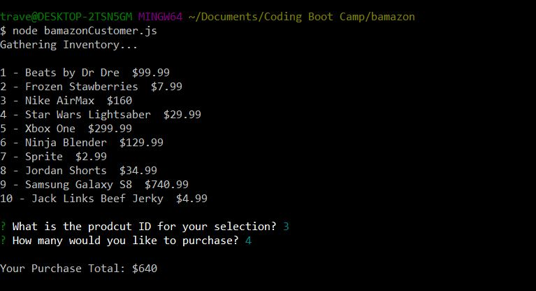

Description

This application implements a node based storefront using the npm inquirer package and the MySQL database backend together with the npm mysql package.

Node Interface
 
 Allows users to view current items that are avialable for purchase. Inventory displays unique ID item name and purchase price. Prompts request selection and quantity. If quantity is available the inventory will be reduced by the requested quantity and the user will display will display purchase total; else the display will let user know we to not have sufficient inventory for order request.

 
 
 
 